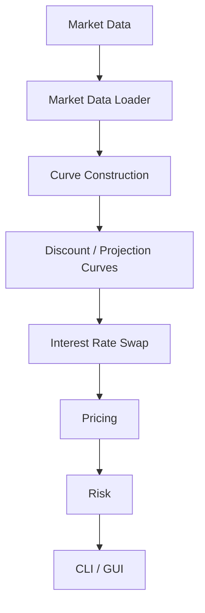
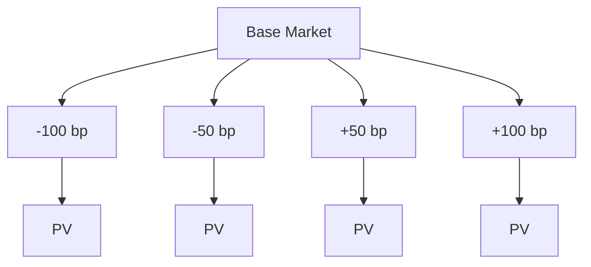

Rates Pricing and Risk Engine – Design

**1. Purpose**

The goal of the rates engine is to provide a small system for pricing and risk analysis of interest-rate instruments.

The initial product scope is a vanilla fixed-for-floating interest rate swap (IRS) under a dual-curve framework:
* a discount curve is used to discount future cash flows;
* a projection curve is used to derive forward rates for the floating leg.

The engine should support the following end-to-end workflow:

**2. Scope**

The first version will include:
* market data loading from JSON;
* discount and projection curve representations;
* configurable curve interpolation;
* curve construction from market quotes;
* vanilla fixed-for-floating IRS representation;
* fixed and floating leg valuation;
* swap NPV;
* par swap rate;
* DV01/PV01;
* parallel interest-rate scenarios;
* automated unit and validation tests;
* CLI and graphical interfaces.

**3. Market Data**

Market data will initially be loaded from JSON files.
The input format must distinguish the discount and projection curves explicitly.
The initial market-data representation is intentionally simplified. Rates represent calibration quotes under conventions defined by the corresponding curve builder. Instrument-specific quote conventions will be introduced together with the bootstrap implementation.

**4. Curve Construction**

Curve construction will use bootstrapping to sequentially derive curve nodes from market quotes. During bootstrap, interpolation may be required to evaluate the partially constructed curve between existing nodes. The completed curve then uses the same interpolation policy to provide values at arbitrary cash-flow dates.

The resulting curves should reprice the calibration instruments within a defined numerical tolerance.

The initial implementation will use one interpolation method: log-linear interpolation of discount factors:

$$ \ln P(t) = \ln P(t_1) + \frac{t-t_1}{t_2-t_1} \left(\ln P(t_2)-\ln P(t_1)\right), \qquad t_1 \le t \le t_2 $$

Alternative interpolation policies may later be introduced to evaluate interpolation model risk.

The pricing framework uses two separate curves.

The discount curve is used to calculate the present value of future cash flows:

$$ PV(CF_t) = CF_t P_d(0,t) $$

The projection curve is used to derive forward rates for the floating leg. For a simple-compounded forward rate:

$$ F(t_1,t_2) = \frac{1}{\alpha} \left(\frac{P_p(0,t_1)}{P_p(0,t_2)} - 1\right), $$

where $P_p$ denotes the projection curve and $\alpha$ is the accrual year fraction.

Therefore, the projection curve determines the projected floating cash flows, while the discount curve determines their present value.

**5. Interest Rate Swap**

The initial instrument is a vanilla fixed-for-floating interest rate swap. The implementation assumes no exchange of notional. Both legs use the same notional. Payment frequencies and accrual conventions are specified independently for each leg.

**5.1. Fixed leg**

For notional $N$, fixed rate $K$, accrual fractions $\alpha_i$, and discount factors $P_d(0,t_i)$:

$$ PV_{\text{fixed}} = N K \sum_{i=1}^{n} \alpha_i P_d(0,t_i) $$

**5.2. Floating leg**

Projected floating cash flows use forward rates from the projection curve:

$$ PV_{\text{float}} = N \sum_{i=1}^{n} \alpha_i F(t_{i-1},t_i) P_d(0,t_i) $$

**5.3. Swap NPV**

A consistent sign convention must be used throughout the engine.

For a payer swap:

$$ NPV_{\text{payer}} = PV_{\text{float}} - PV_{\text{fixed}} $$

For the corresponding receiver swap:

$$ NPV_{\text{receiver}} = -PV_{\text{payer}} $$

**5.4. Par rate**

The par fixed rate $K_{\text{par}}$ is the fixed rate for which swap NPV is zero:

$$ K_{\text{par}} = \frac{ \sum_i \alpha_i F(t_{i-1},t_i) P_d(0,t_i) }{\sum_i\alpha_i P_d(0,t_i)} $$

A swap priced at the calculated par rate should have NPV approximately equal to zero.

**6. Risk**

The initial risk measure is DV01/PV01 and will be calculated using curve bumping and repricing.

For a symmetric one-basis-point parallel curve bump:

$$ DV01 = \frac{PV(\text{curve} - \Delta r) - PV(\text{curve} + \Delta r)}{2}, $$
where
$$ \Delta r = 1\text{ bp} = 10^{-4} $$

This convention measures the approximate increase in portfolio value corresponding to a one-basis-point downward parallel shift of the selected curve.

The corresponding rate derivative is approximated using the central finite difference:

$$ \frac{\partial PV}{\partial r} \approx \frac{PV(\text{curve}+\Delta r) - PV(\text{curve}-\Delta r)}{2\Delta r} $$

The risk engine should allow the discount and projection curves to be shocked independently, as well as together for combined parallel scenarios.

The engine should additionally support parallel rate scenarios. Scenario calculations are independent and therefore provide a natural use case for parallel execution.

